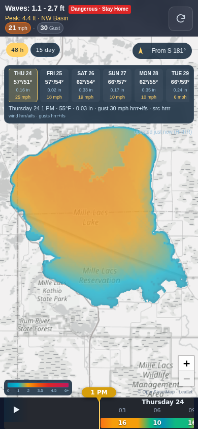
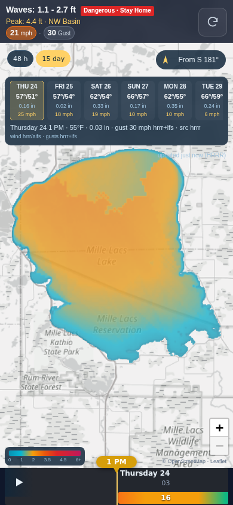
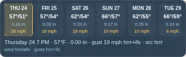

# Big Pond Chop v2

Precomputed 15-day wind-wave forecast for Mille Lacs Lake (Princeton, MN).

**Live: https://xxbeansproutxx.github.io/big-pond-chop-v2/**



## How it works

- A GitHub Actions worker runs hourly, fetches HRRR + AIFS + IFS (Open-Meteo, keyless),
  merges the weather, and computes ~146 wave frames over 15 days.
- It writes `data/` and commits; GitHub Pages republishes → the client is a thin viewer
  that fetches precomputed frames (no on-device wave math).
- Delay-aware math in one line: waves can't respond to a wind shift until energy can
  physically travel the fetch (`delay = fetch / cg`, `cg ≈ 11 mph`) — lake memory.

## Local dev

```sh
python3 -m http.server 8000      # serve repo root, open http://127.0.0.1:8000/
node worker/compute.mjs          # worker dry run (writes data/)
node --test                      # unit suites (parity/render/ui/wind/delay/weather)
```

QA (Playwright; the harnesses need the venv python):

```sh
/home/reid/.hermes/hermes-agent/venv/bin/python tools/qa/pwa_check.py      # add --live for Pages
/home/reid/.hermes/hermes-agent/venv/bin/python tools/qa/scrub_bench.py    # tape scrub perf
```

## Data artifacts

- `data/frames.json` — index: `generated_at`, grid `dims` (285×292), `scale` (0–8 ft @ 1/32 ft),
  `frames:[{i,t,file}]`.
- `data/fNNN.bin` — one Uint8 Hs grid per frame (~83 KB each); `255` = land/nodata,
  else `min(254, round(Hs_ft × 32))`.
- `data/wind.json` — merged hourly series: `fetched_at`, `point`, `models` (hrrr/aifs/ifs),
  `hours:[{t,speed,dir,gust,temp,precip,src}]` (mph / °F / mm).

## More

- [`docs/V2-RECEIPTS.md`](docs/V2-RECEIPTS.md) — phase receipts (verified numbers).
- [`PROGRESS.md`](PROGRESS.md) — phase log.
- [`docs/BUILD-SPEC-V2.md`](docs/BUILD-SPEC-V2.md) — full build plan.
- 15-day tape and weather strip: 
  
